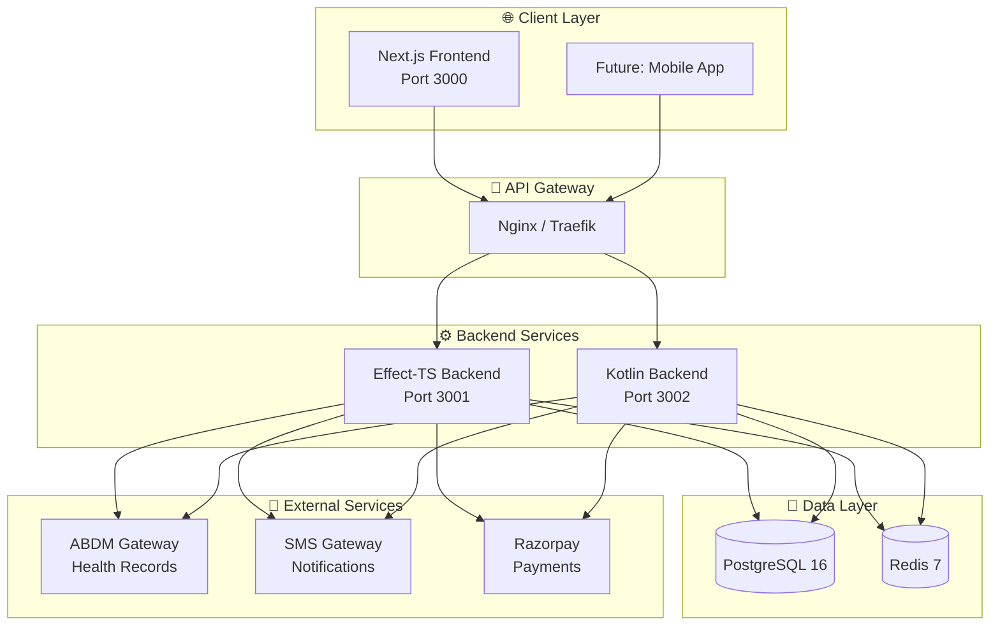
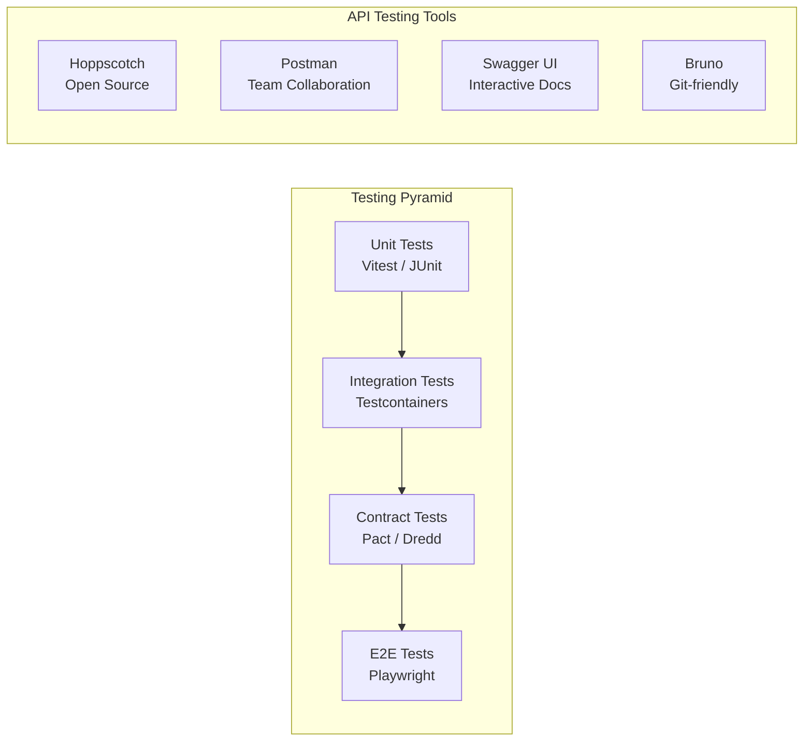
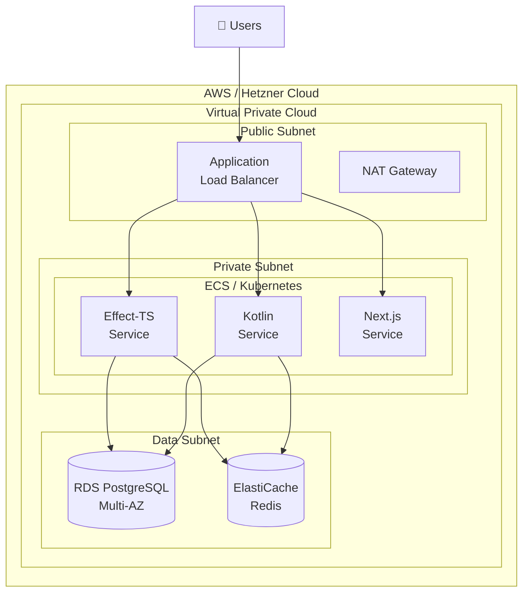

# 🏥 Appointment Booking System

> **Backend Internship Program** - Learn enterprise API development by building a real-world OPD scheduling system for Indian hospitals.

[](https://effect.website/)
[](https://spring.io/projects/spring-boot)
[](https://nx.dev/)
[](CONTRIBUTING.md)

---

## 🎯 What You'll Learn

This project is designed to teach **production-grade backend development**:

| Skill | Technologies | Documentation |
|-------|--------------|---------------|
| **API Design** | REST, OpenAPI 3.1, JSON:API | [API Guide](docs/guides/API-DESIGN.md) |
| **Dual-Stack Development** | Effect-TS vs Kotlin comparison | [Architecture](docs/architecture/SYSTEM.md) |
| **API Testing** | Contract testing, Integration, E2E | [Testing Guide](docs/guides/API-TESTING.md) |
| **Cloud Deployment** | AWS, Hetzner, Docker | [Deployment](docs/guides/CLOUD-DEPLOYMENT.md) |
| **AI-Assisted Development** | Claude Code, Goose, Cursor | [AI Guide](docs/guides/AI-ASSISTED-DEV.md) |

---

## 🏗️ System Architecture



---

## 🚀 Quick Start

### Prerequisites

| Tool | Version | Installation |
|------|---------|--------------|
| **Node.js** | 20+ | `brew install node` |
| **Bun** | 1.x | `brew install oven-sh/bun/bun` |
| **Java** | 21 (OpenJDK) | `brew install openjdk@21` |
| **Docker** | Latest | [Docker Desktop](https://www.docker.com/products/docker-desktop/) |

### 1️⃣ Clone & Install

```bash
# Clone the repository
git clone https://github.com/PearlThoughtsInternship/Appointment-Booking.git
cd Appointment-Booking

# Install dependencies
npm install
```

### 2️⃣ Start Infrastructure

```bash
# Start PostgreSQL and Redis
docker compose -f tools/docker/docker-compose.yml up -d

# Verify services are running
docker compose -f tools/docker/docker-compose.yml ps
```

### 3️⃣ Build & Run

```bash
# Build all applications
npx nx run-many --target=build

# Run Effect-TS backend (Terminal 1)
npx nx serve backend-ts

# Run Kotlin backend (Terminal 2)
npx nx serve backend-kotlin

# Run Next.js frontend (Terminal 3)
npx nx dev web
```

### 4️⃣ Verify Health

```bash
# Effect-TS backend
curl http://localhost:3001/health | jq

# Kotlin backend
curl http://localhost:3002/health | jq
```

> 📖 **Detailed setup guide:** [docs/guides/LOCAL-SETUP.md](docs/guides/LOCAL-SETUP.md)

---

## 📁 Project Structure

```
Appointment-Booking/
├── 📱 apps/
│   ├── web/                    # Next.js 15 frontend
│   ├── backend-ts/             # Effect-TS + Bun backend
│   └── backend-kotlin/         # Spring Boot 3 backend
│
├── 📦 libs/
│   └── shared/
│       └── types/              # Shared TypeScript contracts
│
├── 📚 docs/
│   ├── guides/                 # How-to guides
│   ├── architecture/           # System design docs
│   ├── api/                    # API specifications
│   └── reports/                # Test & quality reports
│
├── 🐳 tools/
│   └── docker/                 # Docker Compose files
│
├── 📋 .speckit/                # Spec-driven development
└── 🔧 nx.json                  # Monorepo configuration
```

---

## 🧪 API Testing Strategy



### Testing Commands

```bash
# Run all tests
npx nx run-many --target=test

# Run Effect-TS tests with coverage
npx nx test backend-ts --coverage

# Run Kotlin tests
npx nx test backend-kotlin

# Run contract tests (coming soon)
npx nx test:contract backend-ts
```

> 📖 **Testing deep dive:** [docs/guides/API-TESTING.md](docs/guides/API-TESTING.md)

---

## 📊 API Documentation Tools Comparison

| Tool | Type | Best For | Setup Guide |
|------|------|----------|-------------|
| **OpenAPI 3.1** | Specification | Source of truth | [Guide](docs/api/OPENAPI.md) |
| **Swagger UI** | Interactive docs | Developer portal | [Guide](docs/api/SWAGGER.md) |
| **Hoppscotch** | API client | Free, open-source | [Guide](docs/api/HOPPSCOTCH.md) |
| **Postman** | API client | Team collaboration | [Guide](docs/api/POSTMAN.md) |
| **Bruno** | API client | Git-versioned collections | [Guide](docs/api/BRUNO.md) |

---

## ☁️ Cloud Deployment Architecture



> 📖 **Deployment guide:** [docs/guides/CLOUD-DEPLOYMENT.md](docs/guides/CLOUD-DEPLOYMENT.md)

---

## 🤖 AI-Assisted Development

We encourage using AI coding assistants to accelerate learning:

| Tool | Best For | Getting Started |
|------|----------|-----------------|
| **Claude Code** | Complex implementations, debugging | [Guide](docs/guides/AI-ASSISTED-DEV.md#claude-code) |
| **Goose** | Autonomous task execution | [Guide](docs/guides/AI-ASSISTED-DEV.md#goose) |
| **GitHub Copilot** | Code completion | [Guide](docs/guides/AI-ASSISTED-DEV.md#copilot) |
| **Cursor** | IDE integration | [Guide](docs/guides/AI-ASSISTED-DEV.md#cursor) |

### Example: Using Claude Code

```bash
# Ask Claude to implement a feature
claude "Implement patient registration endpoint in Effect-TS backend following the existing patterns"

# Debug an issue
claude "Why is the Kotlin health endpoint returning 500? Check the logs and fix it"

# Generate tests
claude "Write integration tests for the appointment booking flow"
```

---

## 📈 Quality Reports

### Test Coverage

| Backend | Unit | Integration | Target |
|---------|------|-------------|--------|
| Effect-TS |  | 🚧 Pending | 80% |
| Kotlin |  | 🚧 Pending | 80% |

### Code Quality

```bash
# Run linting
npx nx run-many --target=lint

# Type checking
npx nx run-many --target=typecheck
```

> 📖 **Sample reports:** [docs/reports/](docs/reports/)

---

## 🎓 Learning Path

### Week 1-2: Foundation
- [ ] Complete local setup
- [ ] Understand project structure
- [ ] Run and test both backends
- [ ] Read API design guide

### Week 3-4: API Development
- [ ] Implement patient registration
- [ ] Write unit tests
- [ ] Add OpenAPI documentation
- [ ] Set up Hoppscotch collection

### Week 5-6: Advanced Topics
- [ ] Implement contract tests
- [ ] Add integration tests
- [ ] Set up CI/CD pipeline
- [ ] Deploy to staging

### Week 7-8: Production Readiness
- [ ] Performance testing
- [ ] Security review
- [ ] Documentation review
- [ ] Final demo

---

## 🤝 Contributing

We welcome contributions! This is a learning project, so don't be afraid to:

- 🐛 Report bugs
- 💡 Suggest features
- 📝 Improve documentation
- 🔧 Submit PRs

> 📖 **Contribution guide:** [CONTRIBUTING.md](CONTRIBUTING.md)

### Good First Issues

Look for issues tagged with:
- `good-first-issue` - Perfect for beginners
- `help-wanted` - We need your help!
- `documentation` - Improve our docs

---

## 📚 Additional Resources

### Official Documentation
- [Effect-TS Documentation](https://effect.website/docs)
- [Spring Boot Documentation](https://docs.spring.io/spring-boot/docs/current/reference/html/)
- [Nx Documentation](https://nx.dev/getting-started/intro)
- [Next.js Documentation](https://nextjs.org/docs)

### Indian Healthcare Context
- [ABDM Official Portal](https://abdm.gov.in/)
- [ABHA Health Account](https://abha.abdm.gov.in/)
- [Scan and Share Guide](https://www.pib.gov.in/PressReleasePage.aspx?PRID=1901721)

### API Design
- [OpenAPI Specification](https://spec.openapis.org/oas/latest.html)
- [JSON:API Specification](https://jsonapi.org/)
- [REST API Guidelines](https://github.com/microsoft/api-guidelines)

---

## 📄 License

Private - PearlThoughts Internship Program

---

<div align="center">

**Built with ❤️ by PearlThoughts Interns**

[Report Bug](https://github.com/PearlThoughtsInternship/Appointment-Booking/issues) · [Request Feature](https://github.com/PearlThoughtsInternship/Appointment-Booking/issues) · [Join Discussion](https://github.com/PearlThoughtsInternship/Appointment-Booking/discussions)

</div>
