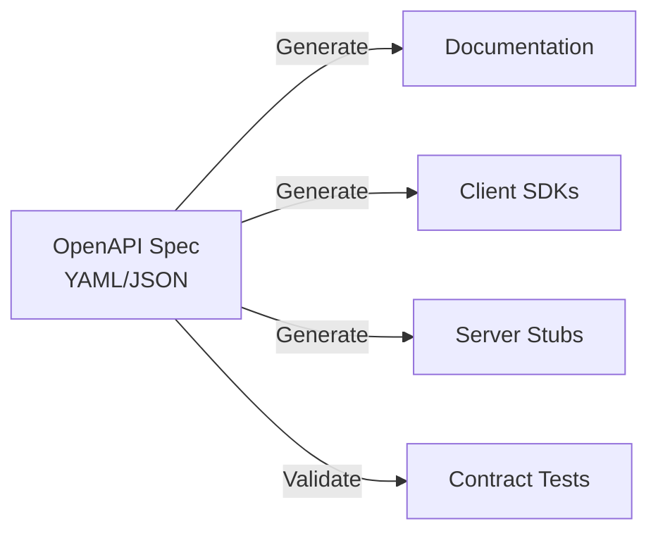

# 📜 OpenAPI Documentation Guide

Learn how to write and maintain OpenAPI specifications for the Appointment Booking API.

---

## What is OpenAPI?

OpenAPI (formerly Swagger) is the industry standard for describing REST APIs.



---

## Project OpenAPI Location

```
docs/api/
├── openapi.yaml          # Main specification file
├── schemas/              # Reusable schemas
│   ├── patient.yaml
│   ├── doctor.yaml
│   └── appointment.yaml
└── paths/                # API paths
    ├── patients.yaml
    ├── doctors.yaml
    └── appointments.yaml
```

---

## Basic Structure

```yaml
# docs/api/openapi.yaml
openapi: 3.1.0

info:
  title: Appointment Booking API
  description: |
    REST API for OPD Appointment Scheduling System.

    ## Authentication
    All endpoints except `/health` require JWT authentication.

    ## Rate Limiting
    - 100 requests/minute for authenticated users
    - 10 requests/minute for unauthenticated
  version: 0.1.0
  contact:
    name: API Support
    email: api@pearlthoughts.com
  license:
    name: Proprietary
    url: https://pearlthoughts.com/license

servers:
  - url: http://localhost:3001
    description: Effect-TS Backend (Development)
  - url: http://localhost:3002
    description: Kotlin Backend (Development)
  - url: https://api.appointment.example.com
    description: Production

tags:
  - name: patients
    description: Patient management
  - name: doctors
    description: Doctor and schedule management
  - name: appointments
    description: Appointment booking
  - name: queue
    description: Queue management

paths:
  /health:
    $ref: './paths/health.yaml'
  /api/v1/patients:
    $ref: './paths/patients.yaml#/collection'
  /api/v1/patients/{id}:
    $ref: './paths/patients.yaml#/item'
  /api/v1/doctors:
    $ref: './paths/doctors.yaml#/collection'
  /api/v1/appointments:
    $ref: './paths/appointments.yaml#/collection'

components:
  schemas:
    $ref: './schemas/_index.yaml'
  securitySchemes:
    bearerAuth:
      type: http
      scheme: bearer
      bearerFormat: JWT

security:
  - bearerAuth: []
```

---

## Schema Definitions

### Patient Schema

```yaml
# docs/api/schemas/patient.yaml
Patient:
  type: object
  required:
    - id
    - name
    - mobile
    - gender
  properties:
    id:
      type: string
      format: uuid
      description: Unique identifier
      example: "550e8400-e29b-41d4-a716-446655440000"
    name:
      type: string
      minLength: 2
      maxLength: 100
      description: Full name of the patient
      example: "Rahul Kumar"
    mobile:
      type: string
      pattern: '^\+91[6-9]\d{9}$'
      description: Indian mobile number with country code
      example: "+919876543210"
    email:
      type: string
      format: email
      description: Email address (optional)
      example: "rahul.kumar@example.com"
    dateOfBirth:
      type: string
      format: date
      description: Date of birth in ISO format
      example: "1990-01-15"
    gender:
      type: string
      enum: [male, female, other]
      description: Gender of the patient
      example: "male"
    abhaId:
      type: string
      pattern: '^\d{14}$'
      description: ABDM Health Account ID (14 digits)
      example: "91234567890123"
    address:
      $ref: '#/Address'
    createdAt:
      type: string
      format: date-time
      readOnly: true
    updatedAt:
      type: string
      format: date-time
      readOnly: true

PatientCreateRequest:
  type: object
  required:
    - name
    - mobile
    - dateOfBirth
    - gender
  properties:
    name:
      type: string
      minLength: 2
      maxLength: 100
    mobile:
      type: string
      pattern: '^\+91[6-9]\d{9}$'
    email:
      type: string
      format: email
    dateOfBirth:
      type: string
      format: date
    gender:
      type: string
      enum: [male, female, other]
    abhaId:
      type: string
      pattern: '^\d{14}$'

Address:
  type: object
  properties:
    line1:
      type: string
      maxLength: 200
    line2:
      type: string
      maxLength: 200
    city:
      type: string
      maxLength: 100
    state:
      type: string
      maxLength: 100
    pincode:
      type: string
      pattern: '^\d{6}$'
      description: 6-digit Indian PIN code
      example: "560001"
```

### Appointment Schema

```yaml
# docs/api/schemas/appointment.yaml
Appointment:
  type: object
  required:
    - id
    - patientId
    - doctorId
    - slotId
    - status
  properties:
    id:
      type: string
      format: uuid
    patientId:
      type: string
      format: uuid
    doctorId:
      type: string
      format: uuid
    slotId:
      type: string
      format: uuid
    status:
      type: string
      enum:
        - scheduled
        - checked-in
        - in-consultation
        - completed
        - cancelled
        - no-show
    tokenNumber:
      type: integer
      minimum: 1
      description: Queue token number for OPD
    consultationFee:
      type: number
      format: decimal
      minimum: 0
      description: Fee in INR
    paymentStatus:
      type: string
      enum: [pending, paid, refunded]
    notes:
      type: string
      maxLength: 500
    cancellationReason:
      type: string
      maxLength: 200
    createdAt:
      type: string
      format: date-time
      readOnly: true

AppointmentCreateRequest:
  type: object
  required:
    - patientId
    - doctorId
    - slotId
  properties:
    patientId:
      type: string
      format: uuid
    doctorId:
      type: string
      format: uuid
    slotId:
      type: string
      format: uuid
    notes:
      type: string
      maxLength: 500
```

---

## Path Definitions

### Patients Endpoint

```yaml
# docs/api/paths/patients.yaml
collection:
  get:
    summary: List all patients
    description: Retrieve a paginated list of patients
    operationId: listPatients
    tags:
      - patients
    parameters:
      - name: page
        in: query
        schema:
          type: integer
          default: 1
          minimum: 1
      - name: pageSize
        in: query
        schema:
          type: integer
          default: 20
          minimum: 1
          maximum: 100
      - name: search
        in: query
        description: Search by name or mobile
        schema:
          type: string
    responses:
      '200':
        description: Successful response
        content:
          application/json:
            schema:
              type: object
              properties:
                items:
                  type: array
                  items:
                    $ref: '../schemas/patient.yaml#/Patient'
                total:
                  type: integer
                page:
                  type: integer
                pageSize:
                  type: integer
                hasMore:
                  type: boolean
      '401':
        $ref: '../responses/errors.yaml#/Unauthorized'
      '500':
        $ref: '../responses/errors.yaml#/ServerError'

  post:
    summary: Create a new patient
    description: Register a new patient in the system
    operationId: createPatient
    tags:
      - patients
    requestBody:
      required: true
      content:
        application/json:
          schema:
            $ref: '../schemas/patient.yaml#/PatientCreateRequest'
          examples:
            basic:
              summary: Basic registration
              value:
                name: "Rahul Kumar"
                mobile: "+919876543210"
                dateOfBirth: "1990-01-15"
                gender: "male"
            withAbha:
              summary: With ABHA ID
              value:
                name: "Priya Sharma"
                mobile: "+919876543211"
                dateOfBirth: "1985-06-20"
                gender: "female"
                abhaId: "91234567890123"
    responses:
      '201':
        description: Patient created
        content:
          application/json:
            schema:
              $ref: '../schemas/patient.yaml#/Patient'
      '400':
        $ref: '../responses/errors.yaml#/BadRequest'
      '409':
        description: Conflict - Mobile number already registered
        content:
          application/json:
            schema:
              $ref: '../schemas/error.yaml#/Error'
            example:
              code: "DUPLICATE_MOBILE"
              message: "A patient with this mobile number already exists"

item:
  get:
    summary: Get patient by ID
    operationId: getPatient
    tags:
      - patients
    parameters:
      - name: id
        in: path
        required: true
        schema:
          type: string
          format: uuid
    responses:
      '200':
        description: Successful response
        content:
          application/json:
            schema:
              $ref: '../schemas/patient.yaml#/Patient'
      '404':
        $ref: '../responses/errors.yaml#/NotFound'
```

---

## Validation Examples

### Request Validation

```yaml
# Validation will fail for these cases:

# Invalid mobile number (wrong pattern)
{
  "name": "Test",
  "mobile": "1234567890",  # Missing +91 prefix
  "dateOfBirth": "1990-01-15",
  "gender": "male"
}

# Name too short
{
  "name": "A",  # minLength: 2
  "mobile": "+919876543210",
  "dateOfBirth": "1990-01-15",
  "gender": "male"
}

# Invalid gender enum
{
  "name": "Test User",
  "mobile": "+919876543210",
  "dateOfBirth": "1990-01-15",
  "gender": "unknown"  # Not in enum
}
```

---

## Tools for OpenAPI

### Viewing/Editing

| Tool | Type | Best For |
|------|------|----------|
| **Swagger Editor** | Web | Quick editing |
| **Stoplight Studio** | Desktop | Visual editing |
| **VS Code + OpenAPI Extension** | Editor | Integrated workflow |

### Validation

```bash
# Install spectral (OpenAPI linter)
npm install -g @stoplight/spectral-cli

# Validate spec
spectral lint docs/api/openapi.yaml
```

### Code Generation

```bash
# Generate TypeScript types
npx openapi-typescript docs/api/openapi.yaml -o libs/shared/types/src/generated.ts

# Generate API client
npx @hey-api/openapi-ts \
  -i docs/api/openapi.yaml \
  -o apps/web/src/lib/api-client
```

---

## Best Practices

### DO ✅

- Use descriptive `operationId`
- Include examples for all schemas
- Document all error responses
- Use `$ref` for reusable components
- Add detailed descriptions

### DON'T ❌

- Don't use generic names like "data"
- Don't skip validation rules
- Don't forget security schemes
- Don't hardcode server URLs

---

## 🏆 Challenge: Complete the API Spec

Add OpenAPI specifications for:

1. **Doctor endpoints** - `/api/v1/doctors`
2. **Appointment booking** - `/api/v1/appointments`
3. **Queue management** - `/api/v1/queue`

Include:
- All CRUD operations
- Validation rules
- Example requests/responses
- Error responses

Submit your spec as a PR! 🚀

---

## 📚 Resources

- [OpenAPI 3.1 Specification](https://spec.openapis.org/oas/latest.html)
- [Swagger Editor](https://editor.swagger.io/)
- [OpenAPI Generator](https://openapi-generator.tech/)
- [Spectral Linter](https://stoplight.io/open-source/spectral)
