# 🏗️ System Architecture

Comprehensive architecture documentation for the Appointment Booking system.

---

## High-Level Overview

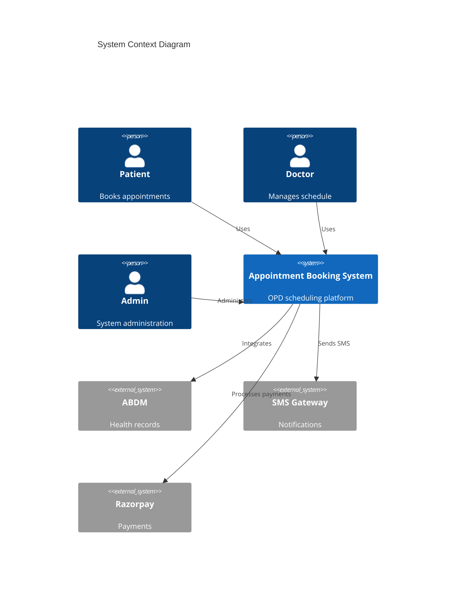

---

## Container Architecture

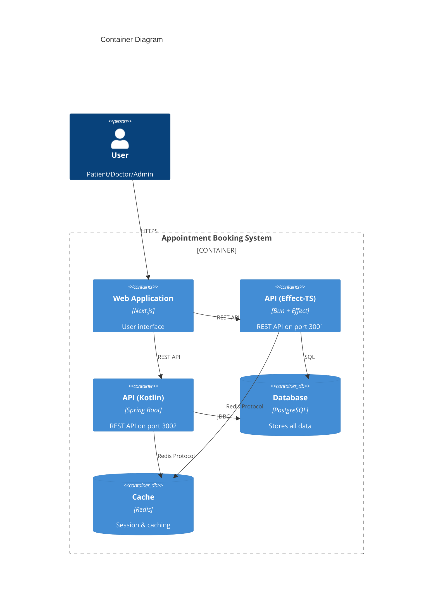

---

## Domain Model

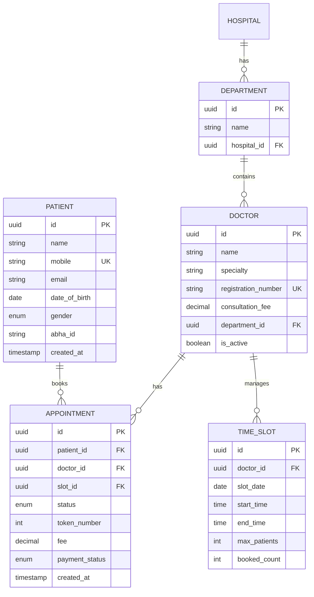

---

## API Design

### Resource Hierarchy

```
/api/v1
├── /patients
│   ├── GET /              # List patients
│   ├── POST /             # Create patient
│   ├── GET /:id           # Get patient
│   ├── PUT /:id           # Update patient
│   └── DELETE /:id        # Delete patient
│
├── /doctors
│   ├── GET /              # List doctors
│   ├── GET /:id           # Get doctor
│   ├── GET /:id/slots     # Get available slots
│   └── PUT /:id/schedule  # Update schedule
│
├── /appointments
│   ├── GET /              # List appointments
│   ├── POST /             # Book appointment
│   ├── GET /:id           # Get appointment
│   ├── PUT /:id/cancel    # Cancel appointment
│   └── PUT /:id/reschedule # Reschedule
│
├── /queue
│   ├── GET /:doctor_id    # Current queue
│   ├── POST /check-in     # Patient check-in
│   └── PUT /call-next     # Call next patient
│
└── /health                # Health check
```

### Request/Response Flow

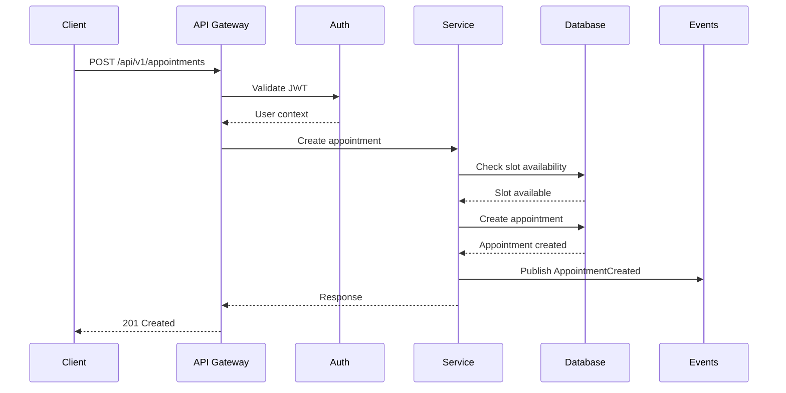

---

## Dual Backend Comparison

### Effect-TS Architecture

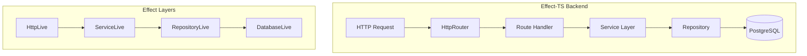

### Kotlin/Spring Architecture

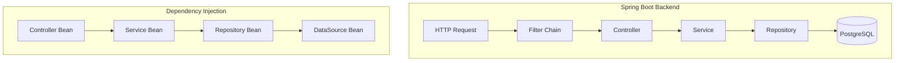

### Comparison Table

| Aspect | Effect-TS | Kotlin/Spring |
|--------|-----------|---------------|
| **Paradigm** | Functional | Object-Oriented |
| **Error Handling** | Typed errors (Effect<A, E, R>) | Exceptions |
| **DI Pattern** | Layer composition | Container injection |
| **Concurrency** | Fiber-based | Thread pools |
| **Type Safety** | Full (compile-time) | Partial (runtime nulls) |
| **Ecosystem** | Growing | Mature |
| **Learning Curve** | Steeper | Moderate |

---

## Data Flow

### Appointment Booking Flow

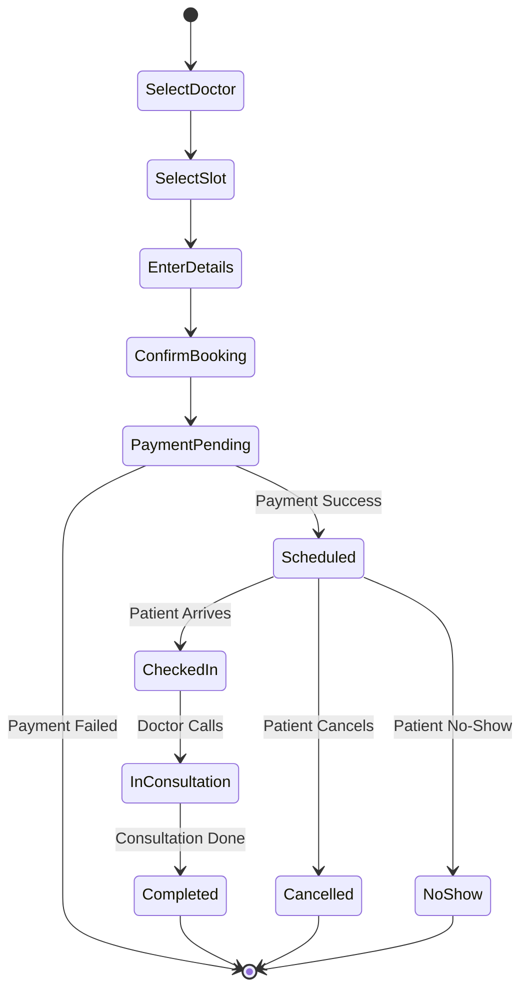

### Queue Management Flow

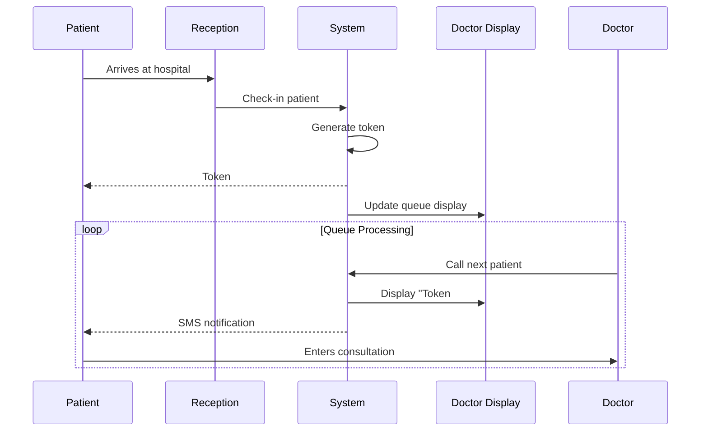

---

## Security Architecture

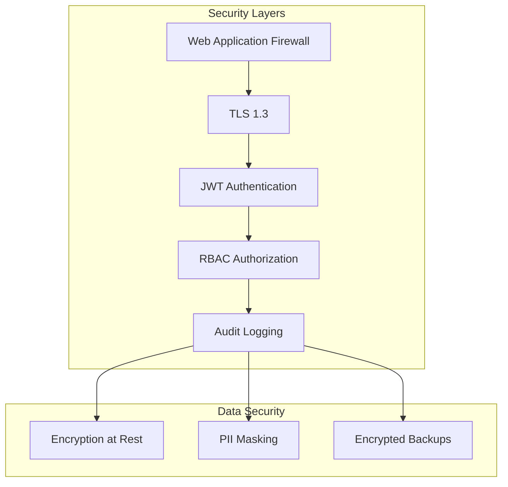

### Role-Based Access Control

| Role | Patients | Doctors | Appointments | Admin |
|------|----------|---------|--------------|-------|
| **Patient** | Own only | View | Own only | ❌ |
| **Doctor** | View assigned | Own only | View assigned | ❌ |
| **Receptionist** | All | View | All | ❌ |
| **Admin** | All | All | All | ✅ |

---

## Scalability Considerations

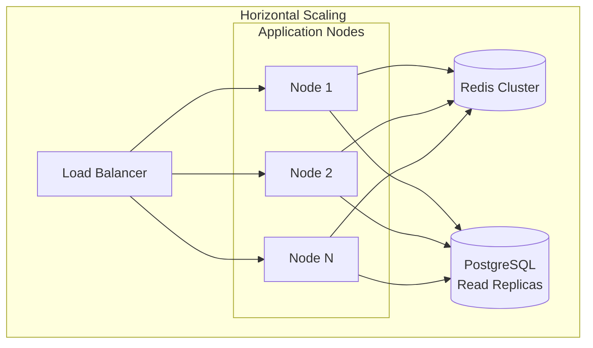

### Scaling Strategies

| Component | Strategy | Trigger |
|-----------|----------|---------|
| **API Servers** | Horizontal (add instances) | CPU > 70% |
| **Database** | Vertical + Read replicas | Connection limit |
| **Cache** | Redis Cluster | Memory > 80% |
| **Queue** | Partition by hospital | Message backlog |

---

## Monitoring & Observability

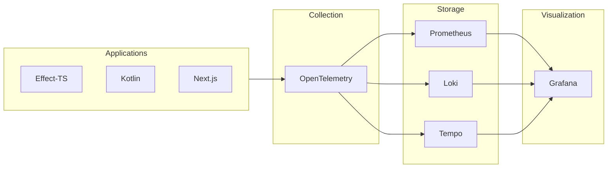

### Key Metrics

| Metric | Target | Alert Threshold |
|--------|--------|-----------------|
| **Response Time (p99)** | < 500ms | > 1s |
| **Error Rate** | < 0.1% | > 1% |
| **Availability** | 99.9% | < 99.5% |
| **Queue Length** | < 100 | > 500 |

---

## 📚 Further Reading

- [12-Factor App](https://12factor.net/)
- [Clean Architecture](https://blog.cleancoder.com/uncle-bob/2012/08/13/the-clean-architecture.html)
- [Domain-Driven Design](https://martinfowler.com/bliki/DomainDrivenDesign.html)
- [Microservices Patterns](https://microservices.io/patterns/)
