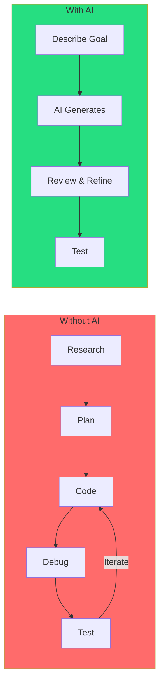
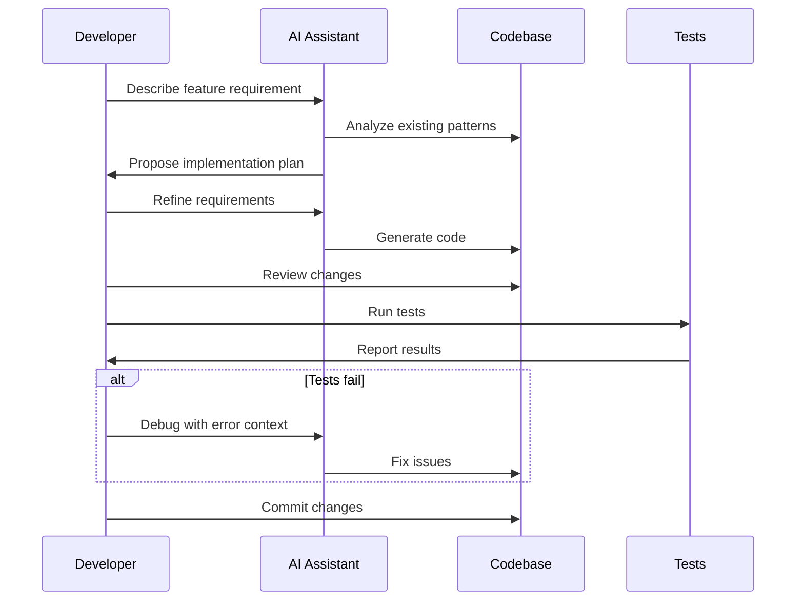

# 🤖 AI-Assisted Development Guide

Accelerate your learning and productivity by leveraging AI coding assistants.

---

## Why Use AI Assistants?



**Benefits:**
- 🚀 **10x faster** implementation
- 📚 **Learn patterns** from AI suggestions
- 🐛 **Debug faster** with AI analysis
- 📝 **Better documentation** generated automatically

---

## Tool Comparison

| Tool | Best For | Cost | Setup |
|------|----------|------|-------|
| **Claude Code** | Complex implementations, debugging | Free tier available | CLI |
| **Goose** | Autonomous task execution | Free (open source) | CLI |
| **GitHub Copilot** | Real-time code completion | $10/month | IDE plugin |
| **Cursor** | Full IDE experience | $20/month | Standalone IDE |
| **Continue.dev** | Open-source IDE integration | Free | VS Code extension |

---

## Claude Code

### Installation

```bash
# Install Claude Code CLI
npm install -g @anthropic-ai/claude-code

# Or use npx directly
npx claude-code
```

### Basic Usage

```bash
# Start Claude Code in your project directory
cd Appointment-Booking
claude

# Or run with a specific prompt
claude "Explain the Effect-TS backend architecture"
```

### Example Prompts for This Project

#### Understanding Code
```
claude "Explain how the HttpRouter works in apps/backend-ts/src/main.ts"
```

#### Implementing Features
```
claude "Implement a patient registration endpoint in the Effect-TS backend that:
1. Validates mobile number (Indian format)
2. Creates patient in database
3. Returns the created patient
Follow the existing patterns in the codebase."
```

#### Writing Tests
```
claude "Write comprehensive unit tests for patient validation logic.
Include edge cases for:
- Invalid mobile numbers
- Missing required fields
- Duplicate registrations"
```

#### Debugging
```
claude "The Kotlin backend returns 500 error when creating appointments.
Error log shows: 'NullPointerException at AppointmentService.java:45'
Help me debug this issue."
```

#### Code Review
```
claude "Review my implementation of the doctor availability endpoint.
Check for:
- Security issues
- Performance problems
- Code quality
- Missing edge cases"
```

### Pro Tips

1. **Be specific** - Include file paths and context
2. **Provide examples** - Show what you expect
3. **Iterate** - Refine based on AI output
4. **Verify** - Always test AI-generated code

---

## Goose

Goose is an open-source autonomous coding agent.

### Installation

```bash
# Install via pipx
pipx install goose-ai

# Or brew (macOS)
brew install block/goose/goose
```

### Configuration

```yaml
# ~/.config/goose/profiles.yaml
default:
  provider: anthropic
  model: claude-sonnet-4-20250514
  toolkits:
    - name: developer
      requires:
        - "git"
        - "npm"
```

### Usage

```bash
# Start Goose session
goose session start

# Give it a task
> Implement patient CRUD operations in the Effect-TS backend

# Goose will:
# 1. Analyze the codebase
# 2. Plan the implementation
# 3. Write the code
# 4. Create tests
# 5. Verify it works
```

### Example Session

```bash
$ goose session start

🪿 Goose: Ready to help! What would you like to do?

> Add a doctor schedule management feature that allows:
> 1. Doctors to set their availability
> 2. Block specific time slots
> 3. View their upcoming appointments

🪿 Goose: I'll implement this feature. Let me first analyze the existing codebase...

[Goose reads files, plans implementation, writes code, tests]

🪿 Goose: Done! I've created:
- apps/backend-ts/src/services/schedule.ts
- apps/backend-ts/src/api/schedule-routes.ts
- apps/backend-ts/src/services/schedule.test.ts

All tests passing. Would you like me to explain the implementation?
```

---

## GitHub Copilot

### Installation

1. Install VS Code extension: "GitHub Copilot"
2. Sign in with GitHub account
3. Enable for TypeScript/Kotlin

### Usage in This Project

#### Auto-completion
```typescript
// Type a comment describing what you want
// Effect-TS handler to create a new appointment with validation
// Copilot will suggest the implementation
```

#### Copilot Chat
```
@workspace How does the appointment booking flow work?

@workspace /explain the HttpRouter configuration

@workspace /tests generate tests for PatientService
```

### Keyboard Shortcuts

| Action | Mac | Windows |
|--------|-----|---------|
| Accept suggestion | `Tab` | `Tab` |
| Reject suggestion | `Esc` | `Esc` |
| Next suggestion | `Alt+]` | `Alt+]` |
| Previous suggestion | `Alt+[` | `Alt+[` |
| Open Copilot Chat | `Cmd+I` | `Ctrl+I` |

---

## Cursor IDE

Cursor is a fork of VS Code with built-in AI features.

### Installation

Download from [cursor.sh](https://cursor.sh)

### Features

1. **Cmd+K** - Edit selected code with AI
2. **Cmd+L** - Chat with codebase context
3. **@ mentions** - Reference files, docs, web

### Example Usage

```
Select code block, press Cmd+K:
"Refactor this to use Effect's pipe pattern instead of method chaining"

Press Cmd+L:
"@appointment.ts @doctor.ts Create a service that validates
appointment bookings against doctor availability"
```

---

## Continue.dev (Open Source)

Free, open-source alternative to Copilot.

### Installation

1. Install VS Code extension: "Continue"
2. Configure provider in `~/.continue/config.json`

```json
{
  "models": [
    {
      "title": "Claude",
      "provider": "anthropic",
      "model": "claude-sonnet-4-20250514",
      "apiKey": "your-api-key"
    }
  ]
}
```

---

## Best Practices

### Do ✅

- **Provide context** - Include relevant file paths
- **Be specific** - Describe exact requirements
- **Review output** - Don't blindly trust AI
- **Test everything** - Verify AI-generated code works
- **Learn from AI** - Understand why it made certain choices

### Don't ❌

- **Skip review** - Always read before committing
- **Paste secrets** - Never share API keys with AI
- **Copy blindly** - Understand what the code does
- **Ignore tests** - AI code needs testing too

---

## AI-Assisted Workflow



---

## Learning with AI

Use AI to accelerate your learning:

### 1. Code Explanation
```
"Explain this Effect-TS code step by step:
[paste code]
Focus on:
- What each Effect combinator does
- How errors are handled
- The Layer pattern usage"
```

### 2. Pattern Learning
```
"Show me 3 different ways to implement repository pattern in Effect-TS.
Compare their trade-offs."
```

### 3. Best Practices
```
"What are the enterprise patterns I should use for the appointment
booking service? Consider CQRS, Event Sourcing, Domain-Driven Design."
```

### 4. Interview Prep
```
"Ask me technical interview questions about:
- REST API design
- Database transactions
- Distributed systems
Provide feedback on my answers."
```

---

## 🏆 Challenge: AI-Powered Feature

Use AI assistants to implement one of these features:

1. **Queue token system** - Generate and manage OPD queue tokens
2. **Appointment reminders** - SMS notification before appointments
3. **Doctor search** - Search with filters (specialty, availability, fees)

Document your AI-assisted development process:
- What prompts did you use?
- How did you refine the output?
- What did you learn?

Submit as a PR with your learnings! 🚀

---

## 📚 Resources

- [Claude Code Documentation](https://docs.anthropic.com/claude-code)
- [Goose Documentation](https://block.github.io/goose/)
- [GitHub Copilot Guide](https://docs.github.com/copilot)
- [Cursor Documentation](https://cursor.sh/docs)
- [Continue.dev Documentation](https://continue.dev/docs)
