# 🧪 API Testing Guide

A comprehensive guide to testing APIs in the Appointment Booking system.

---

## Testing Pyramid

```mermaid
graph TB
    subgraph Pyramid["Testing Pyramid"]
        E2E["🔺 E2E Tests<br/>Few, Slow, Expensive"]
        INT["🔶 Integration Tests<br/>Some, Medium Speed"]
        CONTRACT["🔷 Contract Tests<br/>API Boundaries"]
        UNIT["🟢 Unit Tests<br/>Many, Fast, Cheap"]
    end

    E2E --> INT --> CONTRACT --> UNIT

    style E2E fill:#ff6b6b
    style INT fill:#feca57
    style CONTRACT fill:#48dbfb
    style UNIT fill:#26de81
```



---

## 1. Unit Tests

Unit tests verify individual functions and classes in isolation.

### Effect-TS (Vitest)

```typescript
// apps/backend-ts/src/services/patient.test.ts
import { describe, it, expect } from "vitest"
import { Effect } from "effect"
import { PatientService } from "./patient"

describe("PatientService", () => {
  describe("validateMobile", () => {
    it("should accept valid Indian mobile numbers", () => {
      const result = PatientService.validateMobile("+919876543210")
      expect(result).toBe(true)
    })

    it("should reject invalid mobile numbers", () => {
      const result = PatientService.validateMobile("123")
      expect(result).toBe(false)
    })
  })

  describe("createPatient", () => {
    it("should create patient with valid data", async () => {
      const patient = {
        name: "Rahul Kumar",
        mobile: "+919876543210",
        dateOfBirth: "1990-01-15",
        gender: "male" as const,
      }

      // Using Effect's test utilities
      const result = await Effect.runPromise(
        PatientService.create(patient)
      )

      expect(result.id).toBeDefined()
      expect(result.name).toBe("Rahul Kumar")
    })
  })
})
```

### Kotlin (JUnit 5)

```kotlin
// apps/backend-kotlin/src/test/kotlin/com/appointment/api/service/PatientServiceTest.kt
package com.appointment.api.service

import org.junit.jupiter.api.Test
import org.junit.jupiter.api.Assertions.*
import org.junit.jupiter.params.ParameterizedTest
import org.junit.jupiter.params.provider.ValueSource

class PatientServiceTest {

    private val service = PatientService()

    @Test
    fun `should accept valid Indian mobile numbers`() {
        assertTrue(service.validateMobile("+919876543210"))
    }

    @ParameterizedTest
    @ValueSource(strings = ["123", "abcd", "+1234"])
    fun `should reject invalid mobile numbers`(mobile: String) {
        assertFalse(service.validateMobile(mobile))
    }

    @Test
    fun `should create patient with valid data`() {
        val request = PatientCreateRequest(
            name = "Rahul Kumar",
            mobile = "+919876543210",
            dateOfBirth = "1990-01-15",
            gender = "male"
        )

        val result = service.create(request)

        assertNotNull(result.id)
        assertEquals("Rahul Kumar", result.name)
    }
}
```

### Running Unit Tests

```bash
# All unit tests
npx nx run-many --target=test

# Effect-TS only
npx nx test backend-ts

# With coverage
npx nx test backend-ts --coverage

# Kotlin only
npx nx test backend-kotlin

# Watch mode (Effect-TS)
npx nx test backend-ts --watch
```

---

## 2. Integration Tests

Integration tests verify components work together with real dependencies.

### Using Testcontainers

```typescript
// apps/backend-ts/src/integration/patient.integration.test.ts
import { describe, it, expect, beforeAll, afterAll } from "vitest"
import { PostgreSqlContainer } from "@testcontainers/postgresql"
import { Effect } from "effect"

describe("Patient Integration Tests", () => {
  let container: PostgreSqlContainer
  let connectionString: string

  beforeAll(async () => {
    // Start PostgreSQL container
    container = await new PostgreSqlContainer()
      .withDatabase("test_db")
      .start()

    connectionString = container.getConnectionUri()

    // Run migrations
    await runMigrations(connectionString)
  }, 60000) // 60s timeout for container startup

  afterAll(async () => {
    await container.stop()
  })

  it("should persist patient to database", async () => {
    const patient = {
      name: "Test Patient",
      mobile: "+919876543210",
      dateOfBirth: "1990-01-15",
      gender: "male" as const,
    }

    // Create patient
    const created = await Effect.runPromise(
      PatientRepository.create(patient)
    )

    // Retrieve patient
    const found = await Effect.runPromise(
      PatientRepository.findById(created.id)
    )

    expect(found).toBeDefined()
    expect(found?.name).toBe("Test Patient")
  })
})
```

---

## 3. Contract Tests

Contract tests ensure API providers and consumers agree on the API contract.

### Using Pact

```typescript
// apps/backend-ts/src/contract/patient.pact.test.ts
import { pactWith } from "jest-pact"
import { Matchers } from "@pact-foundation/pact"

pactWith(
  { consumer: "WebApp", provider: "BackendTS" },
  (interaction) => {
    interaction("a request for patient by ID", ({ provider, execute }) => {
      beforeEach(() =>
        provider.addInteraction({
          state: "patient with ID 123 exists",
          uponReceiving: "a request for patient 123",
          withRequest: {
            method: "GET",
            path: "/api/v1/patients/123",
          },
          willRespondWith: {
            status: 200,
            headers: { "Content-Type": "application/json" },
            body: Matchers.like({
              id: "123",
              name: Matchers.string("Rahul Kumar"),
              mobile: Matchers.regex(/\+91\d{10}/, "+919876543210"),
              gender: Matchers.term({
                generate: "male",
                matcher: "male|female|other",
              }),
            }),
          },
        })
      )

      execute("returns the patient", async (mockServer) => {
        const response = await fetch(
          `${mockServer.url}/api/v1/patients/123`
        )
        const patient = await response.json()

        expect(response.status).toBe(200)
        expect(patient.id).toBe("123")
      })
    })
  }
)
```

### Using Dredd (OpenAPI Contract Testing)

```bash
# Install Dredd
npm install -g dredd

# Run contract tests against OpenAPI spec
dredd docs/api/openapi.yaml http://localhost:3001
```

---

## 4. API Testing Tools

### Hoppscotch (Recommended - Free & Open Source)

```bash
# Install Hoppscotch CLI
npm install -g @hoppscotch/cli

# Run collection
hopp test collection.json --env environment.json
```

**Setting up Hoppscotch Collection:**

1. Go to [hoppscotch.io](https://hoppscotch.io)
2. Create a new collection "Appointment Booking API"
3. Add requests:

```json
{
  "name": "Health Check",
  "method": "GET",
  "endpoint": "{{baseUrl}}/health",
  "tests": [
    {
      "name": "Status is 200",
      "script": "pw.expect(pw.response.status).toBe(200)"
    },
    {
      "name": "Status is healthy",
      "script": "pw.expect(pw.response.body.status).toBe('healthy')"
    }
  ]
}
```

### Postman

```javascript
// Postman test script for Patient Creation
pm.test("Status code is 201", function () {
    pm.response.to.have.status(201);
});

pm.test("Patient ID is returned", function () {
    var jsonData = pm.response.json();
    pm.expect(jsonData.data.id).to.be.a('string');
});

pm.test("Response time is less than 500ms", function () {
    pm.expect(pm.response.responseTime).to.be.below(500);
});

// Save patient ID for subsequent requests
var jsonData = pm.response.json();
pm.environment.set("patientId", jsonData.data.id);
```

### Bruno (Git-Friendly)

Bruno stores collections as plain files, perfect for version control:

```
collections/
└── appointment-booking/
    ├── environments/
    │   ├── local.bru
    │   └── staging.bru
    ├── patients/
    │   ├── create-patient.bru
    │   ├── get-patient.bru
    │   └── list-patients.bru
    └── appointments/
        ├── book-appointment.bru
        └── cancel-appointment.bru
```

```bru
# collections/appointment-booking/patients/create-patient.bru
meta {
  name: Create Patient
  type: http
  seq: 1
}

post {
  url: {{baseUrl}}/api/v1/patients
  body: json
}

body:json {
  {
    "name": "Rahul Kumar",
    "mobile": "+919876543210",
    "dateOfBirth": "1990-01-15",
    "gender": "male"
  }
}

tests {
  test("should return 201", function() {
    expect(res.status).to.equal(201);
  });
}
```

---

## 5. Parity Tests (Effect-TS vs Kotlin)

Ensure both backends behave identically:

```typescript
// tests/parity/patient-api.parity.test.ts
import { describe, it, expect } from "vitest"

const BACKENDS = [
  { name: "Effect-TS", url: "http://localhost:3001" },
  { name: "Kotlin", url: "http://localhost:3002" },
]

describe("Patient API Parity Tests", () => {
  describe.each(BACKENDS)("$name Backend", ({ url }) => {
    it("should return healthy status", async () => {
      const response = await fetch(`${url}/health`)
      const data = await response.json()

      expect(response.status).toBe(200)
      expect(data.status).toBe("healthy")
    })

    it("should create patient with same response structure", async () => {
      const patient = {
        name: "Test Patient",
        mobile: "+919876543210",
        dateOfBirth: "1990-01-15",
        gender: "male",
      }

      const response = await fetch(`${url}/api/v1/patients`, {
        method: "POST",
        headers: { "Content-Type": "application/json" },
        body: JSON.stringify(patient),
      })

      const data = await response.json()

      expect(response.status).toBe(201)
      expect(data).toHaveProperty("id")
      expect(data).toHaveProperty("name", "Test Patient")
      expect(data).toHaveProperty("createdAt")
    })
  })
})
```

---

## 6. Test Reporting

### Vitest HTML Report

```bash
# Generate HTML report
npx nx test backend-ts --reporter=html

# Open report
open apps/backend-ts/coverage/index.html
```

### JUnit XML Report (For CI/CD)

```bash
# Kotlin with JUnit XML
npx nx test backend-kotlin --reporter=junit

# Output: apps/backend-kotlin/build/test-results/test/TEST-*.xml
```

### Coverage Thresholds

```typescript
// vitest.config.ts
export default defineConfig({
  test: {
    coverage: {
      provider: "v8",
      reporter: ["text", "html", "lcov"],
      thresholds: {
        lines: 80,
        branches: 80,
        functions: 80,
        statements: 80,
      },
    },
  },
})
```

---

## 7. CI/CD Integration

### GitHub Actions Example

```yaml
# .github/workflows/test.yml
name: Tests

on: [push, pull_request]

jobs:
  test:
    runs-on: ubuntu-latest

    services:
      postgres:
        image: postgres:16
        env:
          POSTGRES_USER: test
          POSTGRES_PASSWORD: test
          POSTGRES_DB: test
        ports:
          - 5432:5432

    steps:
      - uses: actions/checkout@v4

      - name: Setup Node.js
        uses: actions/setup-node@v4
        with:
          node-version: "20"
          cache: "npm"

      - name: Setup Java
        uses: actions/setup-java@v4
        with:
          java-version: "21"
          distribution: "temurin"

      - name: Install dependencies
        run: npm ci

      - name: Run unit tests
        run: npx nx run-many --target=test --parallel=3

      - name: Run parity tests
        run: npx vitest run tests/parity/

      - name: Upload coverage
        uses: codecov/codecov-action@v3
```

---

## 🎯 Testing Checklist

### Before Every PR

- [ ] All unit tests pass
- [ ] New code has unit tests
- [ ] Coverage meets threshold (80%)
- [ ] Parity tests pass (if API changed)

### Weekly

- [ ] Run full integration test suite
- [ ] Review test coverage trends
- [ ] Update contract tests if API changed

---

## 📚 Resources

- [Vitest Documentation](https://vitest.dev/)
- [JUnit 5 User Guide](https://junit.org/junit5/docs/current/user-guide/)
- [Testcontainers](https://testcontainers.com/)
- [Pact Contract Testing](https://pact.io/)
- [Hoppscotch](https://hoppscotch.io/)
- [Bruno API Client](https://usebruno.com/)

---

## 🏆 Challenge: Implement Your Own Tests

Try implementing these tests:

1. **Unit Test**: Validate appointment time slot doesn't overlap
2. **Integration Test**: Book appointment and verify token generation
3. **Contract Test**: Verify doctor availability endpoint
4. **Parity Test**: Compare appointment booking across both backends

Submit your implementation as a PR! 🚀
