# 📊 Sample Test Reports

Examples of test reports for the Appointment Booking system.

---

## Unit Test Report (Vitest)

### Summary

```
 ✓ apps/backend-ts/src/services/patient.test.ts (8 tests) 45ms
 ✓ apps/backend-ts/src/services/appointment.test.ts (12 tests) 67ms
 ✓ apps/backend-ts/src/services/doctor.test.ts (6 tests) 32ms
 ✓ apps/backend-ts/src/api/health.test.ts (3 tests) 12ms

 Test Files  4 passed (4)
      Tests  29 passed (29)
   Start at  10:23:45
   Duration  892ms (transform 234ms, setup 45ms, collect 123ms, tests 156ms)
```

### Detailed Results

| Test Suite | Tests | Passed | Failed | Skipped | Duration |
|------------|-------|--------|--------|---------|----------|
| `patient.test.ts` | 8 | 8 | 0 | 0 | 45ms |
| `appointment.test.ts` | 12 | 12 | 0 | 0 | 67ms |
| `doctor.test.ts` | 6 | 6 | 0 | 0 | 32ms |
| `health.test.ts` | 3 | 3 | 0 | 0 | 12ms |
| **Total** | **29** | **29** | **0** | **0** | **156ms** |

### Test Categories


---

## Coverage Report

### Summary

```
---------------------|---------|----------|---------|---------|
File                 | % Stmts | % Branch | % Funcs | % Lines |
---------------------|---------|----------|---------|---------|
All files            |   78.45 |    72.34 |   85.00 |   79.12 |
 services/           |   82.10 |    75.00 |   90.00 |   83.45 |
  patient.ts         |   95.00 |    90.00 |  100.00 |   95.00 |
  appointment.ts     |   75.00 |    65.00 |   85.00 |   76.00 |
  doctor.ts          |   80.00 |    70.00 |   85.00 |   81.00 |
 api/                |   72.00 |    68.00 |   78.00 |   73.00 |
  routes.ts          |   70.00 |    65.00 |   75.00 |   71.00 |
  middleware.ts      |   78.00 |    74.00 |   85.00 |   79.00 |
 repositories/       |   80.00 |    75.00 |   85.00 |   81.00 |
---------------------|---------|----------|---------|---------|
```

### Coverage Visualization


### Coverage Trends

| Date | Statements | Branches | Functions | Lines |
|------|------------|----------|-----------|-------|
| Week 1 | 45% | 40% | 50% | 46% |
| Week 2 | 58% | 52% | 65% | 59% |
| Week 3 | 72% | 68% | 78% | 73% |
| Week 4 | 78% | 72% | 85% | 79% |

---

## Integration Test Report

### Test Environment

| Component | Version | Status |
|-----------|---------|--------|
| PostgreSQL | 16.1 | ✅ Running |
| Redis | 7.2 | ✅ Running |
| Effect-TS Backend | 0.1.0 | ✅ Running |
| Kotlin Backend | 0.1.0 | ✅ Running |

### Results

```
 PASS  tests/integration/patient-flow.test.ts (4.5s)
   Patient Registration Flow
     ✓ should register new patient (234ms)
     ✓ should reject duplicate mobile (45ms)
     ✓ should validate ABHA ID format (32ms)

 PASS  tests/integration/appointment-flow.test.ts (6.2s)
   Appointment Booking Flow
     ✓ should book appointment with valid slot (456ms)
     ✓ should prevent double booking (123ms)
     ✓ should generate token on check-in (89ms)
     ✓ should update queue status (67ms)

 PASS  tests/integration/doctor-schedule.test.ts (3.8s)
   Doctor Schedule Management
     ✓ should create time slots (178ms)
     ✓ should block specific dates (112ms)
     ✓ should return availability (95ms)

Test Suites: 3 passed, 3 total
Tests:       10 passed, 10 total
Time:        14.5s
```

---

## Parity Test Report

### Backend Comparison

| Endpoint | Effect-TS | Kotlin | Match |
|----------|-----------|--------|-------|
| `GET /health` | ✅ 200 | ✅ 200 | ✅ |
| `POST /api/v1/patients` | ✅ 201 | ✅ 201 | ✅ |
| `GET /api/v1/patients/:id` | ✅ 200 | ✅ 200 | ✅ |
| `POST /api/v1/appointments` | ✅ 201 | ✅ 201 | ✅ |
| `PUT /api/v1/appointments/:id/cancel` | ✅ 200 | ✅ 200 | ✅ |

### Response Schema Comparison

```
Comparing response schemas...

✓ GET /health
  - Effect-TS: { status, service, timestamp }
  - Kotlin:    { status, service, timestamp }
  - Match: 100%

✓ POST /api/v1/patients
  - Effect-TS: { id, name, mobile, gender, createdAt }
  - Kotlin:    { id, name, mobile, gender, createdAt }
  - Match: 100%

✓ POST /api/v1/appointments
  - Effect-TS: { id, patientId, doctorId, slotId, status, tokenNumber }
  - Kotlin:    { id, patientId, doctorId, slotId, status, tokenNumber }
  - Match: 100%

All parity tests passed! ✅
```

### Performance Comparison

| Endpoint | Effect-TS p50 | Effect-TS p99 | Kotlin p50 | Kotlin p99 |
|----------|---------------|---------------|------------|------------|
| Health | 2ms | 8ms | 3ms | 12ms |
| Create Patient | 15ms | 45ms | 18ms | 52ms |
| Book Appointment | 25ms | 78ms | 30ms | 85ms |
| List Appointments | 12ms | 35ms | 14ms | 42ms |

---

## Code Quality Report

### Static Analysis (ESLint/ktlint)

```
Effect-TS Backend:
  ✓ 0 errors
  ⚠ 3 warnings
    - Unused variable 'temp' in patient.ts:45
    - Missing return type in appointment.ts:78
    - Consider using 'const' in doctor.ts:23

Kotlin Backend:
  ✓ 0 errors
  ⚠ 2 warnings
    - Unused import in PatientService.kt:5
    - Function too long in AppointmentService.kt:67
```

### Complexity Metrics

| File | Cyclomatic | Cognitive | Maintainability |
|------|------------|-----------|-----------------|
| `patient.ts` | 8 | 12 | A |
| `appointment.ts` | 15 | 22 | B |
| `doctor.ts` | 6 | 9 | A |
| `PatientService.kt` | 10 | 15 | A |
| `AppointmentService.kt` | 18 | 28 | B |

### Security Scan (npm audit / OWASP)

```
Effect-TS Backend:
  Found 0 vulnerabilities

Kotlin Backend:
  Found 0 vulnerabilities

✓ No security issues detected
```

---

## CI/CD Pipeline Report

### Build Status

```mermaid
flowchart LR
    subgraph Pipeline["CI/CD Pipeline"]
        LINT[Lint] --> BUILD[Build] --> TEST[Test] --> DEPLOY[Deploy]
    end

    LINT -->|✅ Pass| BUILD
    BUILD -->|✅ Pass| TEST
    TEST -->|✅ Pass| DEPLOY
```



### Pipeline Duration

| Stage | Duration | Status |
|-------|----------|--------|
| Checkout | 5s | ✅ |
| Install Dependencies | 45s | ✅ |
| Lint | 12s | ✅ |
| Build Effect-TS | 18s | ✅ |
| Build Kotlin | 3m 45s | ✅ |
| Build Frontend | 32s | ✅ |
| Unit Tests | 1m 15s | ✅ |
| Integration Tests | 2m 30s | ✅ |
| **Total** | **8m 42s** | ✅ |

---

## How to Generate Reports

### Vitest Coverage

```bash
# Generate coverage report
npx nx test backend-ts --coverage

# Open HTML report
open apps/backend-ts/coverage/index.html
```

### JUnit Reports

```bash
# Generate JUnit XML
npx nx test backend-kotlin

# Find reports
ls apps/backend-kotlin/build/test-results/test/
```

### Combined Report

```bash
# Run all tests with reporting
npx nx run-many --target=test --reporter=html

# Generate combined report
npx playwright merge-reports --reporter html ./test-results
```

---

## 🏆 Challenge: Improve Coverage

Current coverage is at 78%. Can you:

1. Add tests to reach 85% coverage
2. Add missing integration tests
3. Implement contract tests
4. Create performance benchmarks

Submit your improved test suite as a PR! 🚀
